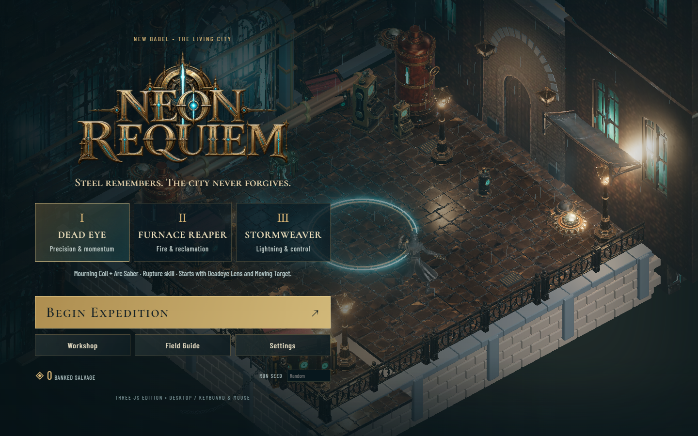
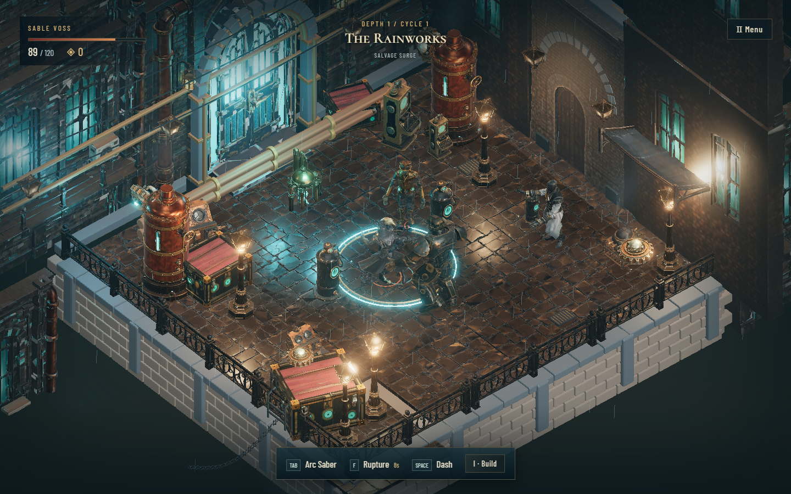

# NEON REQUIEM — The Living City

A steampunk noir, isometric roguelite rebuilt in Three.js from the Unity game. The repository includes the actual Meshy/Blender models, sampled character animations, original logo, fonts, and ElevenLabs audio. Everything runs locally in the browser; no AI service, account, API key, or paid runtime is required.



## Run locally

Use Node.js **22.14 or later** and a current desktop browser with WebGL 2. Microsoft Edge on Windows has been tested. Keyboard and mouse are required; mobile controls are not implemented.

```sh
npm ci
npm run dev
```

Open **http://127.0.0.1:5173**. The first interaction enables audio. Settings includes rendering quality, volume, and save backup/restore.

## Build and package

```sh
npm test
npm run build
```

The `dist/` directory is a self-contained static website. Serve it over HTTP/HTTPS; opening `index.html` directly will fail because browsers restrict local file requests. Relative asset paths support hosting under a subdirectory. Upload the entire directory to a static host; GitHub source check-in alone does not publish a playable website.

To create the Windows package, including a local server, launchers, and precompressed assets:

```sh
npm run package:windows
```

Open `release/NeonRequiemWeb/Launch Neon Requiem.cmd`, or start the server from the repository:

```sh
npm run serve:release
```

Play at **http://127.0.0.1:5180**. Node.js is required for the local launcher, but not on computers playing a hosted copy. The game content is approximately 101 MB uncompressed, or 63 MB transferred when the included server serves Brotli files. Static hosts without compression may transfer more.

## Included gameplay

- Six authored districts, two route branches, and four seeded cover layouts.
- Sable Voss, twelve enemy types, three bosses, animated machinery, rain, steam, and wet-floor reflections.
- Six weapons, three active skills, sixty stackable relics, and three fallback supplies.
- Thirty-six persistent discipline nodes and eighteen weapon mastery tiers.
- Earned salvage, fabricators, healing injectors, volatile capacitors, and the memory tithe.
- Enemy flanking, retreating, aim-triggered dodges, escalating enemy traits, and physical cover.
- Boss defeat leads to extraction or a harder cycle retaining the current run build.
- Title screen, loadouts, field guide, settings, build ledger, training, route choices, and results.

All currency is earned in play. There are **no microtransactions or advertisements**.



## Controls

| Input | Action |
| --- | --- |
| WASD | Move relative to camera |
| Right mouse | Travel around cover |
| Hold left mouse | Fire |
| Shift / Space | Sprint / dash |
| Tab / F | Cycle owned weapons / active skill |
| I | Build ledger |
| E | Interact; extract at the engine |
| N | Descend after defeating a boss |
| G | Memory tithe at a reward screen |
| Q / Alt+E | Orbit camera |
| Scroll / C | Zoom / toggle camera following |
| Escape | Pause |

## Progression and saves

Extract to bank collected salvage plus 30 per cycle; death banks half of the salvage already collected. Spend banked salvage on training before a new expedition.

Browser progression is separate from Unity and saved in local storage under `NeonRequiem.Three.LivingCity.v1`. Saves belong to the browser profile and site address; localhost ports and hosted domains have separate saves. Settings offers backup download and restore before an expedition. Active expeditions do not survive a reload.

## Port details

This is a JavaScript/Three.js implementation of the Unity game. Collision-aware grid navigation replaces Unity NavMesh. Shaders, particles, audio routing, interface layout, animation blending, and post-processing are adapted for the browser; presentation is not pixel-identical to Unity.

Textures use WebP, mostly at 512 pixels, with a 1024-pixel Sable set. Static geometry is batched. High quality enables planar floor reflections and bloom. Choose balanced or low quality for slower GPUs.

The repository includes ready-to-use exports. Unity, Blender, Meshy, and ElevenLabs are not build dependencies. `docs/UnitySceneExport.cs` is the upstream exporter reference; regenerating exports requires the original Unity scene and assets, which are not part of this repository.

## Validation

`npm test` runs 21 gameplay and progression regression tests. Recorded browser results are in `docs/browser-validation.json` and `docs/release-validation.json`.

The browser checks cover real clicks, saved training, keyboard movement, mouse attacks, pause, settings, resize, all six weapons, both route branches, two boss cycles, and extraction. Route traversal uses a development bridge to arrange and clear encounters; this is regression coverage, not a claim of a complete natural playthrough or difficulty balancing.

To repeat the browser checks, start the development server and run `node tools/browser-validation.mjs`. For production checks, start the packaged server on port 5180 and run `node tools/release-validation.mjs`. These scripts use a locally installed Microsoft Edge browser through Playwright and create isolated browser profiles. Reports go to the ignored `artifacts/` directory.

The mutation-capable test bridge is available only in development with `?test=1`. Production exposes a read-only status function and no encounter-skipping or reward-granting controls.

## Licenses and provenance

Code is covered by the repository's existing [MIT license](LICENSE). Project-specific models were generated with Meshy and prepared in Blender/Unity; audio was generated with ElevenLabs. The original Unity project retains the generation records.

Cormorant SC and Barlow Condensed are distributed under the SIL Open Font License; their notices are included in `public/brand/`. Three.js uses the MIT license, included in [docs/THREE-LICENSE.txt](docs/THREE-LICENSE.txt). Preserve third-party license notices when redistributing.
